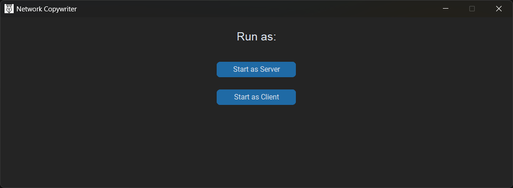
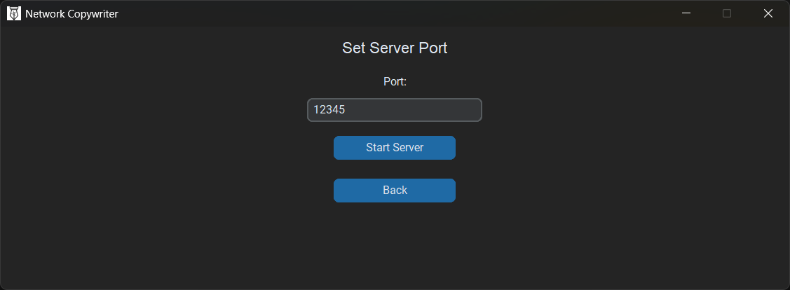
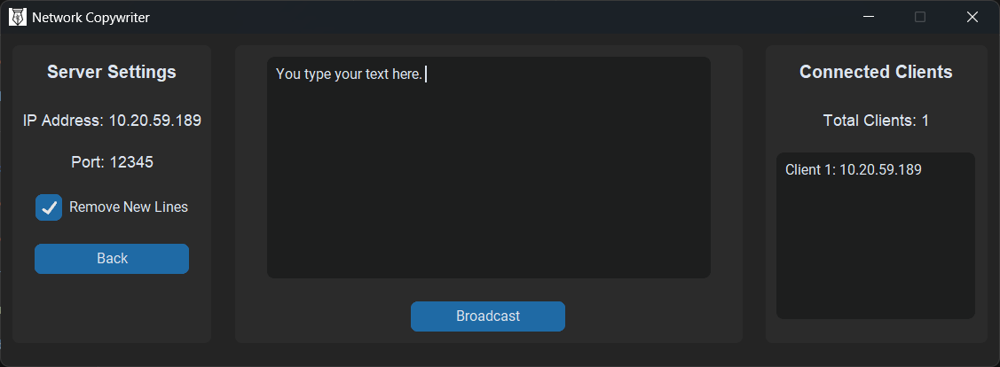
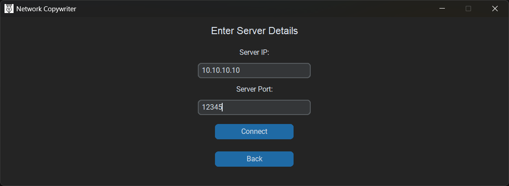
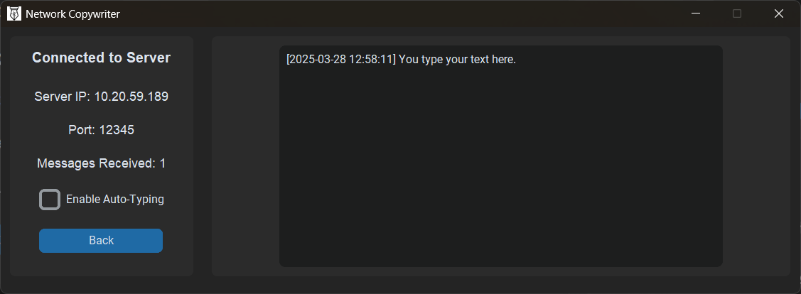

# 🖥️ Network Copywriter

**Network Copywriter** is a Python-based networking application that enables **real-time text broadcasting** between a **server** and multiple **clients** over a network. It provides a **user-friendly GUI** built with **CustomTkinter** and supports **auto-typing** of received messages.

---

## Acknowledgment

This project was developed with ${{\color{red}\textsf{ extensive\ use\ of\ ChatGPT to\ speed\ up\ the\ coding\ process }}}$. However, the success of this project was not solely dependent on AI-generated code. The familiarity and expertise in the tools and technologies used—such as Python, Tkinter, CustomTkinter, and networking concepts—were crucial in understanding, debugging, and refining the implementation.

ChatGPT served as a tool to accelerate development, but the ability to analyze, modify, and optimize the generated code played a key role in ensuring the project's quality and functionality.

---

## 📌 Features

### **🔹 Main Menu**
- Choose to start as **Server** or **Client**.
  
### **🔹 Server Mode**
- Host a **server** and allow multiple clients to connect.
- Shows **server IP & port** (customizable before starting).
- Displays a **list of connected clients** (updates when clients disconnect).
- Broadcast messages to all clients using a text box.
- **Remove newline** option for better formatting.
- Gracefully **disconnects all clients** when the server stops.

### **🔹 Client Mode**
- Connect to a **server** by entering its **IP & port**.
- **Displays incoming messages with timestamps & date**.
- **Auto-typing feature** (optional) to type received messages using `pyautogui`.
- Shows **total messages received**.
- Disconnects cleanly by sending a **disconnect signal** to the server.

---

## 🚀 Installation & Setup

### **🔹 Prerequisites**
- Python 3.9+
- `pip` (Python package manager)

### **🔹 Install Dependencies**
Run the following command:
```sh
pip install -r requirements.txt
```

### **🔹 Run the Application**
Start the application using:
```sh
python NetworkCopyWriter.py
```

---

## 🖼️ Screenshots

### **Main Menu**


### **Server Page**



### **Client Page**



---

## 🛠️ Build as Windows Executable

To create a standalone **Windows executable**, use:
```sh
pyinstaller --onefile --windowed --icon=logo.ico --add-data "logo.ico;." main.py
```
- `--onefile` → Creates a single EXE file.
- `--windowed` → Hides the console window.
- `--icon=logo.ico` → Sets the app icon for the EXE.
- `--add-data "logo.ico;."` → Ensures logo.ico is included in the package.

---

## 🎯 Contributing

1. **Fork** this repository.
2. **Clone** your fork:
   ```sh
   git clone https://github.com/UtpalKuma-r/NetworkCopyWriter.git
   ```
3. **Create a new branch**:
   ```sh
   git checkout -b feature-branch
   ```
4. **Make changes** and **commit**:
   ```sh
   git commit -m "Added new feature"
   ```
5. **Push to GitHub**:
   ```sh
   git push origin feature-branch
   ```
6. Open a **Pull Request** 🚀.

---

## 📜 License

This project is licensed under the **MIT License**. See [LICENSE](LICENSE) for details.

---

## 📧 Contact

For any queries or contributions, feel free to reach out!

🔗 **GitHub**: [UtpalKuma-r](https://github.com/UtpalKuma-r)  
🔗 **LinkedIn**: [Utpal Kumar](https://www.linkedin.com/in/findutpalkumar/)
